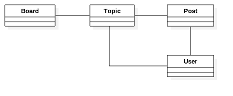

Our project is a discussion board (a forum). The whole idea is to maintain several boards, which will behave like categories. Then, inside a specific board, a user can start a new discussion by creating a new topic. In this topic, other users can engage in the discussion posting replies.

We will need to find a way to differentiate a regular user from an admin user because only the admins are supposed to create new boards. Below, an overview of our main use cases and the role of each type of user:

# Class Diagram

From the Use Case Diagram, we can start thinking concerning the entities of our project. The entities are the models we will create, and it’s very closely related to the data our Django app will process.

For us to be able to implement the use cases described in the previous section, we will need to implement at least the following models: Board, Topic, Post, and User

# Wireframes

After spending some time designing the application models, I like to create some wireframes to define what needs to be done and also to have a clear picture of where we are going.

